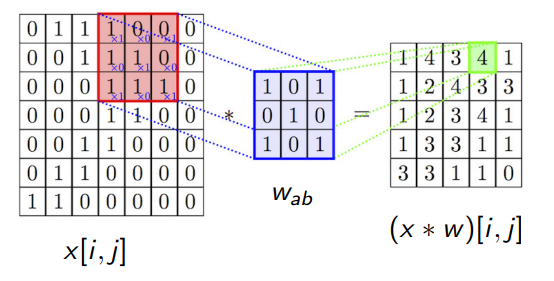

# Свертка. Паддинг. Пулинг. Страйд. Тензор

**Свёртка** - это линейное преобразование над парой матриц $A$ (размера $n_x \times n_y$) и $B$ (размера $m_x \times m_y$), результатом которой является матрица $C = A \cdot B$ (размера $(n_x - m_x + 1) \cdot (n_y - m_y + 1)$). Каждый элемент результата вычисляется как скалярное произведение матрицы $B$ и некоторой подматрицы $A$ такого же размера (подматрица определяется положением элемента в результате). После операции свёртки размер матрицы может быть изменен.

$$
  C = A \cdot B \iff C_{i, j} = \sum_{u = -|A|}^{|A|}{\sum_{v = -|B|}^{|B|}{A_{u, v} \cdot B_{i + u, j + v}}}
$$

**Паддинг** (или: **дополнение**) - это увеличение размерностей матрицы до необходимых размеров. Заполнять искусственные элементы можно:

- нулями (нулевой сдвиг);
- последним и первым элементом по разным сторонам (расширение границ);
- элементами зеркального сдвига;
- элементами циклического сдвига.

**Пуллинг** - это преобразование над матрицей, понижающий размерность матрицы, некоторым преобразованием. Здесь мы ужимаем непересекающиеся прямоугольники в один элемент, применяя к ним нелинейные преобразования (обычно максимум). Далее берём следующий прямоугольник с шагом *страйда*.

**Страйд** - шаг свертки, сдвиг применения ядра или пуллинга (обычно 1).

**Тензор** - это $N$-мерная матрица, где $N > 2$.
