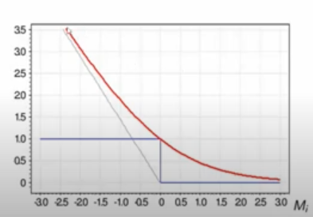

# Метод логистической регрессии. Сигмоида

Для начала рассмотрим задачу бинарной классификации, для которой мы пытаемся предсказать вероятность того, принадлежит ли объект одному классу, или другому

$$q_+ + q_- = 1$$

Можно было бы предсказывать вероятность одного из классов, скажем $q_+$ Это не задача регресии, потому что $0 \leq q_+ \leq 1$, а не просто $q_+ \in \mathbb{R}$

Но здесь нам больше интересно обратное преобразование: $\log{\frac{q_+}{1-q_+}} \in \mathbb{R}$. Такое преобразование называется логит-преобразование. Основная его идея в том, что мы из вероятности делаем число.

А пространство, в котором мы что-то предсказываем от -бесконечности, до +бесконечности, например вычисляем скалярное произведение называется логит пространством.

Возьмем для предсказания линейную регрессию:

$$\log \frac{q_+}{1 - q_+} = \langle \theta, x \rangle$$

Инвертируем формулу

$$q_+ = \frac{1}{1 + e^{-\langle \theta, x \rangle}}$$

Эта функция называется **сигмоидой**.

То есть логистическая регрессия выглядит следующим образом:

$$a_{\text{LogReg}}(x) = \sigma (\langle \theta, x \rangle),$$

Где $\sigma(x) = \frac{1}{1 + e^{-x}}$ -- сигма функция.

Для логистической регрессии используется логарифмическая функция потерь:

$$\mathcal{L}(a, D) = \sum_{(x, y) \in D} \ln(1 + \exp(-\langle \theta, x \rangle y)) \\ещ \min_{\theta}.$$

По факту это перекрестная энтропия, в которую мы поставили сигмоиду нашего предсказания. У сигмоиды как раз таки такое свойство, что если мы посчитаем 1-сигмоида, то это то же самое, что и отрицание скалярного произведения внутри самой сигмоиды. Поэтому внутри логарифмической функции потерь мы получаем что-то похожее на функцию отступа.
