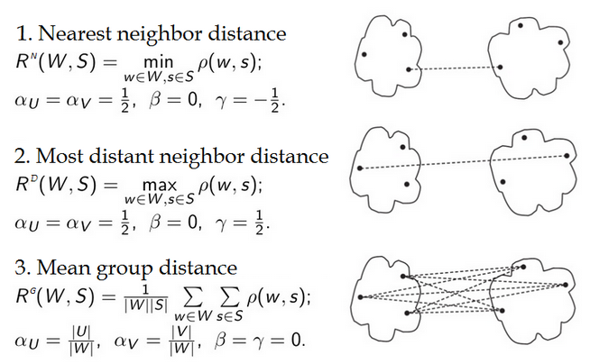
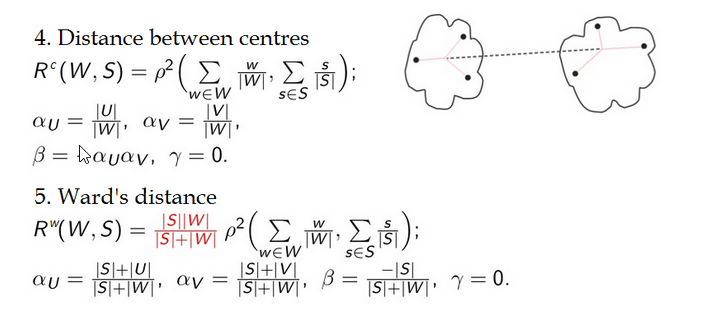
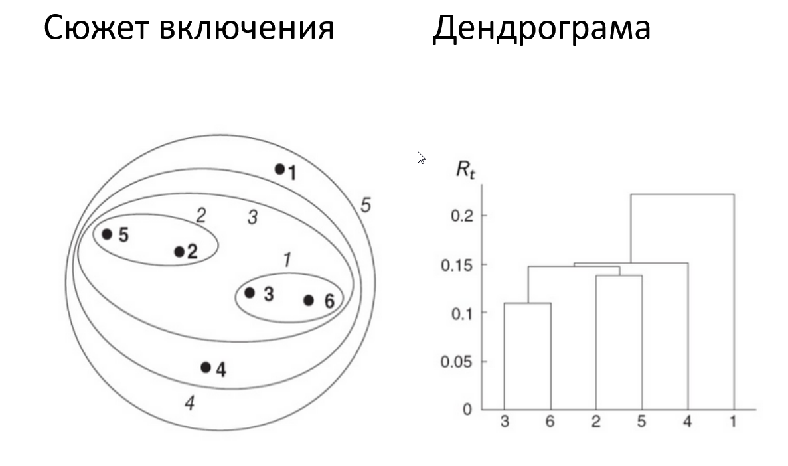

# Графовые методы кластеризации. Иерархические методы кластеризации

## Графовые методы кластеризации

1) Вершина графа - объект
2) Ребро графа - расстояние между точками

### Алгоритм №1

1) Зафиксируем радиус $\text{R}$
2) Удалим рёбра $(u, v) : \rho(u, v) > R$
3) Кластеры соответствуют связанным компонентам.

  - Получить нужное число кластеров можно с помощью бинарного поиска по $R.$

### Алгоритм №2 

1) Зафиксируем число кластеров $К$.
2) Найдём минимальное остовное дерево.
3) Удалим $К - 1$ ребро с наибольшими длинами.

  - Получение иерархии кластеров 

    Если запоминать историю разделения компонент связности, то можно
    получить иерархию кластеров.

## Иерархические методы кластеризации

Дендограмма - дерево иерархии кластеров

Есть два подхода:

1) Разделяющий ("дробление" кластеров)
2) Агломеративный (объединение кластеров)

### Расстояние Lance-Williams

$R(W, S), \space \text{где} \space W = U \cup V$ \
$R(U \cup V, S) = \alpha_{U} R(U, S) + \alpha_{V} R(V, S) + \beta R(U, V) + \gamma |R(U, S) - R(V, S)|$

### Варианты расстояния Lance-Williams

### Алгоритм

Как я его понял:

1) Находим две вершины, которые находятся ближе всего друг к другу
2) Объединяем их в один кластер
3) Дальше проджолжаем обединять наши вершины и кластеры в новые кластеры

Получаем вот такую картину:

Что нам делать дальше? \
Надо обрезать на уровне самой маленькой вертикальной палочки (отметил стелочкой) \

У нас получается 3 кластера:
1) 3, 6, 5, 2 
2) 4
3) 1

P.s. ну или можете подрезать на таком уровне, на каком вам нужно (для получения определенного количества кластеров)

Кластеризация называется **монотонной**, если межкластерное
расстояние не уменьшается после объединения.

Если совсеми просто, то на денодограмме у нас не будет будет ситуаций, когда ребро (вертикальная палка) растет вниз.

### Теорема

Кластеризация является монотонной, если:

1) $\alpha_{U}, \alpha_{V} >= 0$
2) $\alpha_{U} + \alpha_{V} + \beta >= 1$
3) $min(\alpha_{U}, \alpha_{V})+ \gamma >= 0$
