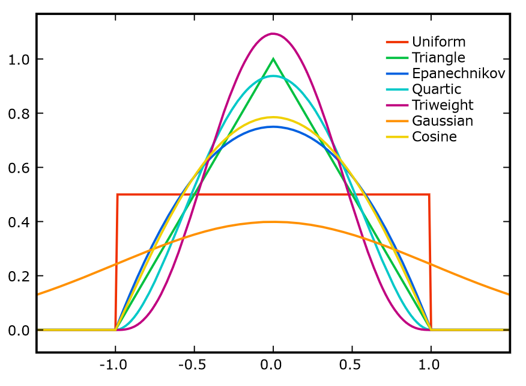

# Ядерная функция для kNN и SVM

## $k$NN

**Ядерная функция** $K(x)$ - это симметричная неотрицательная функция, $\int_{-\infty}^{+\infty}{K(x)\,\partial{x}} = 1$.

Замечаем: чем дальше от расстояния (в данном случае, от точки $0.0$), тем меньше значение. Здесь представлены следующие ядерные функции:

- $\text{Uniform}(u) = \dfrac{1}{2} \cdot [u < 1]$
- $\text{Triangular}(u) = (1 - |u|) \cdot [u < 1]$
- $\text{Epanechnikov}(u) = \dfrac{3}{4} \cdot (1 - u^2) \cdot [u < 1]$
- $\text{Gaussian}(u) = \dfrac{1}{\sqrt{2\pi}} \cdot \exp{\left(\dfrac{-u^2}{2}\right)}$

Сам $k$NN не использует ядро. Ядерная функция используется при взвешенном $k$NN - при присвоении различных вес разным соседям в зависимости от их расстояния до нового образца. Чем ближе сосед к новому образцу, тем больше вес ему присваивается.

## SVM

Идея *ядерного трюка*: попробуем найти неявное отображение в пространство большей размерности такое, что точки в этом новом пространстве будут линейно-разделимыми. Давайте сделаем некоторую подмену в признаках объектов с помощью ядерной функции. Основная проблема - найти ядро, которое переводит исходное пространство в линейно разделимое.

Функция $K : X \times X \to \mathbb{R}$ является **функцией ядра**, если её можно представить в таком виде: $K(x, x') = \langle\psi(x),\psi(x')\rangle$, где $\psi$ это отображение $X \to H$, где $H$ - это [гильбертовое пространство](https://ru.wikipedia.org/wiki/%D0%93%D0%B8%D0%BB%D1%8C%D0%B1%D0%B5%D1%80%D1%82%D0%BE%D0%B2%D0%BE_%D0%BF%D1%80%D0%BE%D1%81%D1%82%D1%80%D0%B0%D0%BD%D1%81%D1%82%D0%B2%D0%BE) с скалярном произведением.

**Теорема** (необходимое условие). Функция $K(x, x')$ - ядерная функция, если она:

- симметричная: $K(x, x') = K(x', x)$,
- неотрицательно определена на $\mathbb{R}$, для любой функции $g : X \to \mathbb{R}$:

  $$
    \int_{X}{\int_{X}{\left(K(x, x') \cdot g(x) \cdot g(x')\,\partial{x}\partial{x'}\right)}} \geqslant 0
  $$

Ядра можно синтезировать. Константа также является ядром по сути. Самих ядер существует великое множество.

Примеры функций ядра:

- Квадратичное: $K(x, x') = \langle x, x' \rangle^{2}$
- Многочлен с мономиальной степенью, равной $d$: $K(x, x') = \langle x, x' \rangle^{d}$
- Многочлен с мономиальной степенью $\leqslant d$: $K(x, x') = \left(\langle x, x'\rangle + 1\right)^{d}$
- Нейронные сети: $K(x, x') = \sigma{(\langle x, x'\rangle)}$
- Радиально-базисный: $K(x, x') = \exp{(-\beta\|x - x'\|^2)}$

Синтез ядер:

- $K(x, x') = \langle x, x'\rangle$ — функция ядра;
- константа $K(x, x') = 1$ — функция ядра;
- $K(x, x') = K_1(x, x')K_2(x, x')$ — функция ядра;
- $\forall \psi : X \to \mathbb{R}K(x, x') = \psi(x)\psi(x')$ — функция ядра;
- $K(x, x') = \alpha_1K_1(x, x') + \alpha_2K_2(x, x')$ при $\alpha_1\alpha_2 > 0$ — функция ядра;
- $\forall \phi : X \to X$ если $K_0$ — функция ядра, тогда $K(x, x') = K_0(\phi(x), \phi(x'))$ также является функцией ядра;
- если $s : X \times X \to \mathbb{R}$ — симметричная и интегрируемая, тогда $K(x, x') = \int_{X}{s(x, z)s(x', z)\,\partial{z}}$ — функция ядра.
